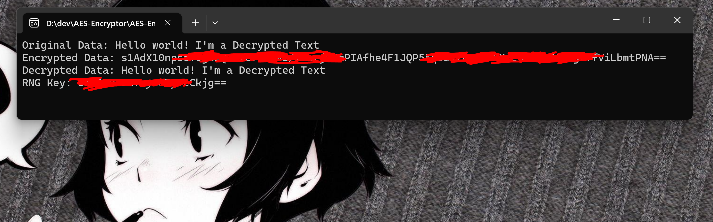

# AES Encryption Project

<div align="center">
  


</div>

This is a simple AES Encryption Console Project written in C#. It allows you to encrypt and decrypt sensitive data using the Advanced Encryption Standard (AES) algorithm.

<br/>

## Table of Contents

- [Introduction](#introduction)
- [Features](#features)
- [Getting Started](#getting-started)
  - [Prerequisites](#prerequisites)
  - [Installation](#installation)
- [How to Use](#how-to-use)
  - [Encrypting Data](#encrypting-data)
  - [Decrypting Data](#decrypting-data)
- [Tutorials](#tutorials)
  - [Generating a Secure Encryption Key](#generating-a-secure-encryption-key)
  - [Encrypting Data](#encrypting-data-tutorial)
  - [Decrypting Data](#decrypting-data-tutorial)
- [Contributing](#contributing)
- [License](#license)

<br/>

## Introduction

This AES Encryption Console Project is designed to provide a simple and secure way to encrypt and decrypt sensitive data in C#. The Advanced Encryption Standard (AES) algorithm is widely used and provides a high level of security for data protection.



<br/>

## Features

- Encrypt sensitive data using AES algorithm
- Decrypt previously encrypted data
- Secure generation and management of encryption keys

<br/>

## Getting Started

### Prerequisites

- [.NET SDK](https://dotnet.microsoft.com/download)
- [Git](https://git-scm.com/downloads)

### Installation

1. Clone the repository:

   ```bash
   git clone https://github.com/KR0N-SECURITY/AES-Encryptor.git
   ```

2. After this, go to the destination folder:

   ```bash
   cd AES-Encryptor
   ```

3. Build the project:   
   ```bash
   dotnet build
   ```

<br/>

## How to Use

### Encrypting Data
To encrypt data, follow these steps:
1. Open a terminal or command prompt.
2. Navigate to the project directory.
3. Run the encryption command:
   
   ```bash
   dotnet run --project AES-Encryptor -- --encrypt
   ```
   
5. Enter the data you want to encrypt when prompted.
6. The encrypted data and the encryption key will be displayed.

### Decrypting Data
To decrypt data, follow these steps:
1. Open a terminal or command prompt.
2. Navigate to the project directory.
3. Run the decryption command:
   
   ```bash
   dotnet run --project AES-Encryptor -- --decrypt
   ```

4. Enter the encrypted data and encryption key when prompted.
5. The decrypted data will be displayed.

<br/>

## Tutorials

### Generating a Secure Encryption Key
To ensure the security of your encrypted data, it's essential to generate a strong and secure encryption key. Follow these steps to generate a secure key:
1. Open a terminal or command prompt.
2. Navigate to the project directory.
3. Run the key generation command:

   ```bash
   dotnet run --project AES-Encryptor -- --generate-key
   ```

4. A new encryption key will be displayed. Copy and securely store this key for future use.

### Encrypting Data Tutorial
In this tutorial, you will learn how to encrypt data using the AES Encryption Console Project.
1. Follow the steps in the ["Encrypting Data"](#encrypting-data) section above.
2. Enter the data you want to encrypt when prompted.
3. The console will display the encrypted data and the encryption key. Copy and store the encrypted data and encryption key securely.

### Decrypting Data Tutorial
In this tutorial, you will learn how to decrypt data using the AES Encryption Console Project.
1. Follow the steps in the ["Decrypting Data"](#decrypting-data) section above.
2. Enter the encrypted data and encryption key when prompted.
3. The console will display the decrypted data.

Congratulations! You have successfully decrypted the data.

<br/>

## Contributing

Contributions are welcome! If you find any issues or have ideas for improvements, please open an issue or submit a pull request.

<br/>

## License

This project is licensed under the [MIT License](LICENSE). Feel free to use, modify, and distribute the code as permitted by the terms of the MIT License.
